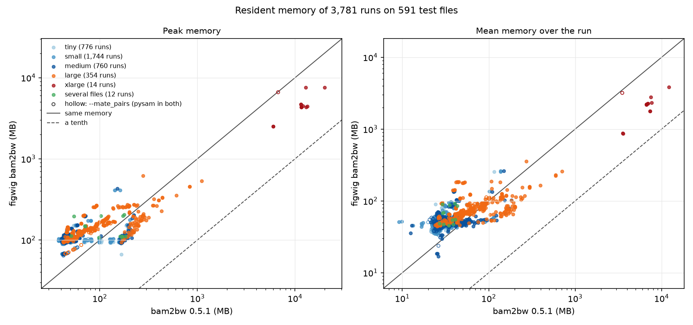
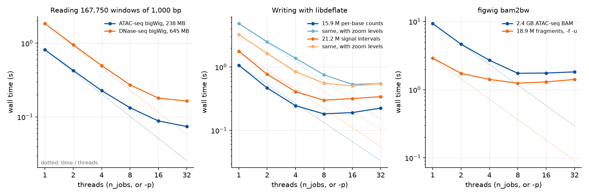

# figwig

[](https://pepy.tech/projects/figwig) [](https://github.com/jmschrei/figwig/actions/workflows/python-package.yml) [](https://figwig.readthedocs.io/en/latest/?badge=latest)

[[docs](https://figwig.readthedocs.io/en/latest/index.html)][[release notes](https://figwig.readthedocs.io/en/latest/whats_new.html)]

A fast, multithreaded reader and writer of bigWig files, into and out of
numpy. Built on work from Nezar Abdennur and Jack Huey.

Loading training data for a genomics model means reading the signal under tens
or hundreds of thousands of windows: 1,000 bp around every peak and background
region of an experiment, say. figwig reads all of them in one call, straight
into a float32 array, from one bigWig or from several at once, and writes
bigWigs from the same windows, such as a model's predictions, or from
intervals. The common readers make one call per window, and each call holds
Python's GIL, so adding threads does not help them. figwig decompresses and
compresses with zlib or libdeflate and decodes with numba, all without the
GIL, so its threads run in parallel.

Its command, `figwig bam2bw`, turns SAM/BAM files of reads, or BED/tsv files
of fragments, into bigWigs of per-base counts. It is
[bam2bw](https://github.com/jmschrei/bam2bw) with the same arguments, outputs
and messages, with faster readers. figwig depends only on numpy and numba.

| | figwig | fastest other tool |
|---|---|---|
| Read 167,750 windows of 1,000 bp from an ATAC-seq bigWig | **0.135 s** on 8 threads | 1.25 s, pybigtools |
| Write 15.9 million per-base counts | **0.18 s** on 8 threads | 4.20 s, pyBigWig |
| Write 21.2 million intervals, with zoom levels | **0.55 s** on 8 threads | 5.47 s, pybigtools |
| Convert a 2.4 GB ATAC-seq BAM to two stranded bigWigs | **4.65 s**, 910 MB peak, at `-p 2` | 58.48 s, 3,039 MB peak, bam2bw 0.5.1 |

Measured on a 2x AMD EPYC 9575F with Python 3.13 and numba 0.68. The
[benchmarks page](https://figwig.readthedocs.io/en/latest/benchmarks.html) has
the full setup.

<details>
<summary><b>More numbers and plots</b></summary>

#### Reading

167,750 windows of 1,000 bp centred on the fold-0 training peaks and negatives
of ENCODE ATAC-seq experiment ENCSR123WME, read from the ATAC-seq bigWig
ENCFF830RWF (238 MB) and the DNase-seq bigWig ENCFF989SAK (645 MB) on tmpfs,
sorted by position, file opening included; median of three runs. The other
libraries' 8-thread runs split the windows into 8 chunks on a thread pool.
Every library returned the same values, once pyBigWig's NaN for bases without
an interval was set to 0.

| library | ATAC, 1 thread | ATAC, 8 threads | DNase, 1 thread | DNase, 8 threads |
|---|---|---|---|---|
| pybigtools 0.2.5, `values()` per window | 1.25 s | 1.42 s | 1.98 s | 2.21 s |
| pyBigWig 0.3.26, `values()` per window | 3.95 s | 4.08 s | 4.50 s | 4.64 s |
| pybbi 0.4.2, `stackup` | 9.61 s | 9.48 s | 10.75 s | 10.63 s |
| figwig 0.1.0 | 0.81 s | **0.135 s** | 1.85 s | **0.277 s** |

#### Writing

The plus-strand 5' ends of ENCODE ATAC-seq BAM ENCFF877LRY, as counts at
15,875,960 single bases, and the fold-change signal ENCFF932UQM, as 21,212,477
intervals, written from memory onto tmpfs at compression level 6, opening and
closing included; median of three runs. pybigtools always writes zoom levels.

| writer | counts | counts, zoom levels | signal | signal, zoom levels |
|---|---|---|---|---|
| pyBigWig 0.3.26 | 4.20 s | 12.80 s | 7.41 s | 10.48 s |
| pybigtools 0.2.5 | | 4.45 s | | 5.47 s |
| figwig, zlib, 1 thread | 4.25 s | 12.09 s | 6.21 s | 8.10 s |
| figwig, zlib, 8 threads | 0.53 s | 1.63 s | 0.78 s | 1.09 s |
| figwig, libdeflate, 1 thread | 1.07 s | 4.85 s | 1.80 s | 3.27 s |
| figwig, libdeflate, 8 threads | **0.18 s** | **0.75 s** | **0.30 s** | **0.55 s** |

figwig's files were the size of pyBigWig's. For the counts, its peak memory
was above pyBigWig's without zoom levels, 554 MB against 354 MB on one thread,
and below it with them, 739 MB on 8 threads against 1,089 MB.

#### figwig bam2bw

ENCODE ATAC-seq BAM ENCFF877LRY (2.4 GB) at default flags, and 18.9 million
scATAC-seq fragments with `-f -u`, from the page cache; figwig's median of
five runs at `-p 2` and one at `-p 8`, and one run of bam2bw, which reads one
file in one process whatever `-p` is.

| | BAM | fragments | peak memory, BAM | peak memory, fragments |
|---|---|---|---|---|
| bam2bw 0.5.1, `-p 2` | 58.48 s | 28.45 s | 3,039 MB | 2,866 MB |
| figwig bam2bw, `-p 2` | **4.65 s** | **1.73 s** | 910 MB | 1,061 MB |
| figwig bam2bw, `-p 8` | **1.82 s** | **1.31 s** | 949 MB | 1,180 MB |

Both also ran on every one of 591 public BAM, SAM, BED and TSV test files that
bam2bw takes, from 3 records to a 10 GB ATAC-seq BAM, under 5 to 9 sets of
flags each, timed once, 16 at a time. In all 3,781 runs that bam2bw
completed, figwig bam2bw gave the same exit code, messages and decoded
entries. Where bam2bw took a second or more, figwig bam2bw was a median 3.2
times faster; where bam2bw took under half a second, figwig bam2bw took a
median 0.12 s longer, mostly importing numba.




The memory runs were made before figwig bam2bw dropped the keys it had
counted while still reading a BAM. On the 10 GB BAM at `-p 1` its peak is now
2.9 GB, against bam2bw's 11.6 GB, and 4.9 GB with `-u -f`, against 20.2 GB.

#### Threads

The same reads, writes and conversions at 1 to 32 threads, one run at a time,
median of three. Reading gained up to 32 threads, writing with libdeflate up
to 8 or 16, and figwig bam2bw up to about 8.



</details>

## Installation

```bash
pip install figwig
```

Or, with [uv](https://docs.astral.sh/uv/):

```bash
uv add figwig
```

It needs Python 3.10 or later, numpy 1.23 or later, and numba 0.58 or later.
Optional extras:

- `figwig[fast]` adds the `deflate` package, which makes writing several times
  faster.
- `figwig[bam2bw]` adds pysam, pyfaidx, biopython, tqdm, isal and deflate,
  which `figwig bam2bw` needs. `figwig bam2bw` runs on Linux and macOS, since
  pysam does not support Windows.

```bash
pip install "figwig[fast]"
pip install "figwig[bam2bw]"
```

### Development install

```bash
git clone https://github.com/jmschrei/figwig.git
cd figwig
uv sync --extra dev
uv run pytest
```

## Claude Code Skill

figwig ships a [Claude Code](https://claude.com/claude-code) skill that
teaches a coding agent to use figwig in any project: reading windows,
writing predictions, intervals and counts, converting reads with
`figwig bam2bw`, the rules a write follows, what each error means, and how
much threads gain. Install it into `~/.claude/skills/figwig` with:

```bash
figwig install-skill
```

After upgrading figwig, run `figwig install-skill --force` to replace the
installed copy, which otherwise raises `FileExistsError`. `-d DIRECTORY`
installs into another skills directory, and `--symlink` links to the copy
inside the installed package instead of copying it.

## Python API

The examples read two public ENCODE bigWigs: the ATAC-seq signal of HG02943
(ENCFF830RWF, 238 MB) and the DNase-seq signal of dorsolateral prefrontal
cortex (ENCFF989SAK, 645 MB).

```bash
wget https://www.encodeproject.org/files/ENCFF830RWF/@@download/ENCFF830RWF.bigWig
wget https://www.encodeproject.org/files/ENCFF989SAK/@@download/ENCFF989SAK.bigWig
```

#### Reading windows

```python
import numpy
from figwig import BigWigReader

bw = BigWigReader("ENCFF830RWF.bigWig")
chroms = numpy.array(["chr1", "chr1", "chr2"])
starts = numpy.array([1_000_000, 2_500_000, 300_000])
y = bw.read(chroms, starts, width=1000, n_jobs=8)
print(y.shape, y.dtype)
# (3, 1000) float32
print(y.sum(axis=1))
# [116.  43.  10.]
```

Window `j` covers `[starts[j], starts[j] + width)` on `chroms[j]`, 0-based as
in BED files, and is written into row `j`, whatever order the windows are
given in. A base that no interval covers is `missing`, 0 unless given, and a
base past the end of its chromosome is NaN. A `BigWigReader` reads the file's
index once and keeps it, and can be pickled to DataLoader workers.

#### Reading several bigWigs into one array

```python
import numpy
from figwig import read_bigwig

chroms = numpy.array(["chr1", "chr1", "chr2"])
starts = numpy.array([1_000_000, 2_500_000, 300_000])
y = read_bigwig(["ENCFF830RWF.bigWig", "ENCFF989SAK.bigWig"], chroms, starts,
	width=1000)
print(y.shape)
# (3, 2, 1000)
```

Channel `i` holds the values from the `i`-th file, in the
`(batch, channels, length)` layout that sequence models take, and every
file's work shares one pool of threads.

#### Writing windows

```python
import numpy
from figwig import read_bigwig
from figwig import write_bigwig

chrom_sizes = {"chr1": 248_956_422, "chr2": 242_193_529}
chroms = numpy.array(["chr2", "chr1", "chr1"])
starts = numpy.array([300_000, 2_500_000, 1_000_000])
y_hat = numpy.random.default_rng(0).random((3, 2, 1000), dtype=numpy.float32)

write_bigwig(["plus.bw", "minus.bw"], chrom_sizes, chroms, starts, y_hat)
y = read_bigwig(["plus.bw", "minus.bw"], chroms, starts, width=1000)
print(numpy.array_equal(y, y_hat))
# True
```

`write_bigwig` takes what `read_bigwig` gives, such as a model's predictions
for the same windows. A base whose value is `missing`, 0.0 unless given, or
NaN is left out of the file, so that reading with the same `missing` gives
the values back.

#### Writing a batch at a time

```python
from figwig import BigWigReader
from figwig import BigWigWriter

chrom_sizes = {"chr1": 248_956_422, "chr2": 242_193_529}
with BigWigWriter("example.bw", chrom_sizes) as writer:
	writer.write("chr1", [1000, 2000], [0.5, 2.0], ends=[1500, 2100])
	writer.write("chr1", [5000, 5003, 5004], [[3], [1], [1]])
	writer.write("chr2", [10_000], [[0.0, 1.5, 1.5, 0.0, 2.5]])

y = BigWigReader("example.bw").read(["chr1", "chr2"], [5000, 10_000], width=6)
print(y)
# [[3.  0.  0.  1.  1.  0. ]
#  [0.  1.5 1.5 0.  2.5 0. ]]
```

`BigWigWriter` writes intervals (with `ends`), single bases (windows of width
1) and windows as they come, so a track larger than memory can be written a
batch at a time. Each call's items come after the last call's, in the order
of `chrom_sizes`. The header, index and zoom levels are written when the
writer is closed.

The documentation's [reading](https://figwig.readthedocs.io/en/latest/reading.html)
and [writing](https://figwig.readthedocs.io/en/latest/writing.html) guides
cover the rest: values and coordinates, chromosomes a file does not have,
PyTorch data loaders, binned values, the files figwig refuses and falling back
to another reader, compression, zoom levels, and files identical to
pyBigWig's.

## Command line

#### figwig bam2bw

```bash
figwig bam2bw my.bam -s hg38.chrom.sizes -n test-run -p 8                  # test-run.+.bw, test-run.-.bw
figwig bam2bw fragments.tsv.gz -s hg38.chrom.sizes -n test-run -f -u -p 8  # test-run.bw
```

`figwig bam2bw` is bam2bw 0.5.1 with the same arguments, output files and
messages, except that `-p` is a number of cores, 1 unless given. By default
it counts the 5' end of every mapped read at each base, and writes the counts
of the two strands to two bigWigs; `-u` writes one, `-f` counts both ends of
each fragment, `-3p` the 3' ends, `-ps`, `-ns`, `-sf` and `-r` shift and scale
the counts, and `-z` writes zoom levels. A BAM file is inflated by libdeflate
and walked by a numba kernel on `-p` threads, and a BED/tsv file is scanned
by a numba kernel; SAM files, `--mate_pairs`, remote files and malformed
records go through bam2bw's own pysam or line loop, so that their result, or
their error, is bam2bw's. The bigWigs hold bam2bw's entries but not its bytes,
since figwig compresses them with libdeflate at level 1. `figwig bam2bw -h`
lists the arguments, [bam2bw's README](https://github.com/jmschrei/bam2bw)
has an example of each, and the
[documentation](https://figwig.readthedocs.io/en/latest/bam2bw.html) says how
files are read and shared across cores.

#### figwig install-skill

Installs the Claude Code skill; see [above](#claude-code-skill).

## Origin

figwig began as the bigWig reader inside
[tangermeme](https://github.com/jmschrei/tangermeme)'s `extract_loci`
(PR #107). It was checked there against pybigtools, bit for bit, on the
training and validation sets of 92 Cherimoya models and on 3,131 synthetic
cases.
