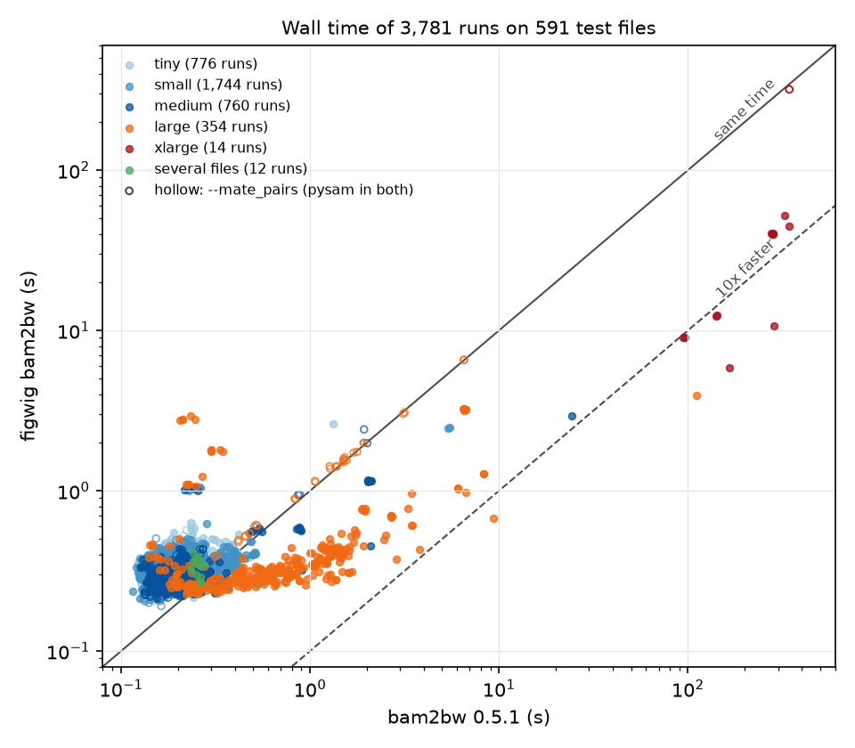

figwig bam2bw
=============

``figwig bam2bw`` turns SAM/BAM files of reads, or BED/tsv files of fragments,
into bigWigs of per-base counts. It is `bam2bw
<https://github.com/jmschrei/bam2bw>`_ 0.5.1 with the same arguments, the same
output files and the same messages, except that ``-p`` is a number of cores.
It reads files the way the winner of a speed search over bam2bw's code reads
them, and writes them with :class:`~figwig.BigWigWriter`. It needs the
``bam2bw`` extra, which adds pysam, pyfaidx, biopython, tqdm, isal and
deflate:

.. code-block:: bash

    pip install ".[bam2bw]"

    figwig bam2bw my.bam -s hg38.chrom.sizes -n test-run -p 2                  # test-run.+.bw, test-run.-.bw
    figwig bam2bw fragments.tsv.gz -s hg38.chrom.sizes -n test-run -f -u -p 2  # test-run.bw

By default it counts the 5' end of every mapped read at each base, and writes
the counts of the two strands to two bigWigs, ``<name>.+.bw`` and
``<name>.-.bw``. Several input files are pooled. Reads on chromosomes that
the sizes file does not list are left out, and counts that fall outside a
chromosome, after a shift, are left out and reported.

.. code-block:: text

    usage: figwig bam2bw [-h] -s SIZES [-u] [-f | -3p] [-ps POS_SHIFT]
                         [-ns NEG_SHIFT] [-mp] [--rna5 {read1,read2}]
                         [--opposite_strand] [-sf SCALE_FACTOR] [-r] [-p PARALLEL]
                         -n NAME [-z ZOOMS] [-v]
                         filename [filename ...]

    positional arguments:
      filename              The SAM/BAM or tsv/tsv.gz file to be processed.

    options:
      -h, --help            show this help message and exit
      -s, --sizes SIZES     A chrom_sizes, .fai, or FASTA file. Only the first two
                            columns of a chrom_sizes/.fai file are read. A
                            compressed FASTA must be BGZF, not gzip.
      -u, --unstranded      Have only one, unstranded, output.
      -f, --fragments       The data is fragments and so both ends should be
                            recorded.
      -3p, --three_prime    Record the 3' end of each read instead of the 5' end.
      -ps, --pos_shift POS_SHIFT
                            A shift to apply to positive strand reads.
      -ns, --neg_shift NEG_SHIFT
                            A shift to apply to negative strand reads.
      -mp, --mate_pairs     Treat paired-end reads as a single RNA/fragment tag
                            instead of counting each mate independently: buffer
                            reads by name, and once both mates of a pair are seen,
                            record one jointly-determined position (see --rna5 and
                            --opposite_strand). BAM/SAM input only.
      --rna5 {read1,read2}  Which mate carries the 5' end of the RNA/fragment. The
                            other mate's own 5' end is used as the RNA's 3' end.
                            Only used with --mate_pairs.
      --opposite_strand     Report the strand of the mate opposite the one chosen
                            by --rna5, instead of that mate's own strand. Only
                            used with --mate_pairs.
      -sf, --scale_factor SCALE_FACTOR
                            A scaling factor to multiply each position by.
      -r, --read_depth      Whether to divide through by total (pre-scaled) read
                            depth.
      -p, --parallel PARALLEL
                            The number of cores to use, or a negative number to
                            count back from the number of CPUs: -1 is all of them.
      -n, --name NAME
      -z, --zooms ZOOMS     The number of zooms to store in the bigwig.
      -v, --verbose

How it reads
------------

A BAM file's BGZF blocks are inflated by libdeflate on the ``-p`` threads, and
its records are walked by a numba kernel rather than through pysam's objects;
the kernel writes one integer key per counted position, and sorting the keys
and counting the runs of equal keys gives each chromosome's counts. A BED/tsv
file is scanned by a numba kernel, on the ``-p`` threads when it is BGZF or not
compressed.

A file these readers would not read exactly as htslib, or bam2bw's own loop
over lines, would read it is read by bam2bw's pysam or line loop instead, so
that its result, or its error, is bam2bw's: a SAM file, ``--mate_pairs``, a
remote file, or a malformed record or line.

``-p`` is a number of cores, where bam2bw takes it as a number of processes,
one per file at most. Files the fast readers take are read one after another,
each on every core: three BAMs of 2.4, 1.8 and 0.45 GB took 7.1 s at ``-p 3``,
against 11.1 s with a process per file on one core each. Files that are read
on one thread whatever ``-p`` is (SAM, ``--mate_pairs``, remote files, and
gzipped BED/tsv files that are not BGZF) are read by a pool of processes, one
per file up to ``-p``, while the other files are read on the cores the pool
leaves. A negative ``-p`` counts back from the number of CPUs, so that ``-1`` is
all of them, and ``-p 0`` is an error.

Speed
-----

On every file of a collection of public test data that bam2bw takes (591 BAM,
SAM, BED and TSV files from 28 assay directories, from 3 records to a 10 GB
ATAC-seq BAM, each under 5 to 9 sets of flags), ``figwig bam2bw`` gave the same
exit code, messages and decoded bigWig entries as bam2bw 0.5.1 in all 3,781
runs that bam2bw completed. Each run was timed once, 16 at a time,
interpreter start-up included:

Where bam2bw took a second or more, figwig bam2bw was a median 3.2 times
faster, and 7 times faster on the 10 GB BAM at ``-p 1``, or 27 times at
``-p 4``. Where bam2bw took under half a second, figwig bam2bw took a median
0.12 s longer, most of it importing numba and loading its compiled kernels.
With ``--mate_pairs`` (hollow points) both read with pysam's loop. The points
well above the line are TSV files that are not coordinates, whose every line
names a different sequence that is not in the sizes file: the fast reader
returns to Python for each new name, where bam2bw's loop skips the line.

How it writes
-------------

The counts are written by :class:`~figwig.BigWigWriter`, as single bases
(varStep sections), with libdeflate at level 1 on up to ``-p`` threads, so the
bigWigs hold bam2bw's entries but not its bytes, and are the same whatever
``-p`` is. ``-z`` writes figwig's zoom levels rather than pyBigWig's. The
entries and messages were checked against bam2bw 0.5.1's on the speed search's
own cases: a 2.4 GB ATAC-seq BAM and 18.9 million scATAC fragments, four
synthetic BAM and SAM files, nine other real invocations covering
``--mate_pairs``, ``-3p``, ``-z``, shifts, scaling, three BAMs at once and a
FASTA as the sizes, and 51 malformed BAMs, each at six settings of ``-p``,
``-v``, ``-f`` and ``-u``.
